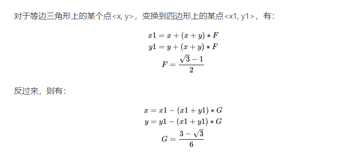
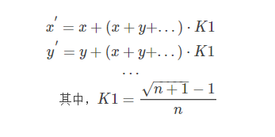

#图形学笔记：噪声

***本篇文章更多的是自己的学习理解，因此会有大量与参考的文章相同的部分***

## 1.噪声是什么
    就我个人的理解，噪声就是对现实世界之中的对物品表现效果产生影响的各种因素的叠加态的模拟。

<!--    -->
<u>频率：频率指的是采样的距离，采样点约密集则频率越高</u>  
<u>振幅：指的是噪声的值域</u>  
<u>分型布朗运动FBM：将不同频率的噪声按照不同的权重混合</u>

## 2.哪些噪声
### 2.1 Perlin噪声
    1. 定义一个**方形**晶格结构
    2. 输入一个点，找到与之相邻的晶格的顶点，连接得到距离向量，再与晶格顶点的随机梯度向量点乘。事件复杂度为（2^n，n为空间维度）。随机梯度向量有优化过的方法，不再单纯使用Random。
    3. 使用缓和曲线进行线性插值，缓和曲线输入值为输入点到各个顶点的距离，即输入点的小数点部分。类似与二次线性插值，但是插值函数为：
    s(t)=6t^5−15t^4+10t^3
### 2.1.1 实现

    # .py
    import random
    import math
    from PIL import Image

    perm = list(range(256))
    random.shuffle(perm)
    perm += perm #拉长一倍
    # dirs 为长度256的方向向量。通过读取来实现随机
    dirs = [(math.cos(a * 2.0 * math.pi / 256),
            math.sin(a * 2.0 * math.pi / 256))
            for a in range(256)]

    def noise(x, y, per):
        def surflet(gridX, gridY):
            distX, distY = abs(x-gridX), abs(y-gridY)
            polyX = 1 - 6*distX**5 + 15*distX**4 - 10*distX**3
            polyY = 1 - 6*distY**5 + 15*distY**4 - 10*distY**3
            hashed = perm[perm[int(gridX)%per] + int(gridY)%per]
            grad = (x-gridX)*dirs[hashed][0] + (y-gridY)*dirs[hashed][1]
            return polyX * polyY * grad
        intX, intY = int(x), int(y)
        return (surflet(intX+0, intY+0) + surflet(intX+1, intY+0) +
                surflet(intX+0, intY+1) + surflet(intX+1, intY+1))  

    def fBm(x, y, per, octs):
        val = 0
        for o in range(octs):
            val += 0.5**o * noise(x*2**o, y*2**o, per*2**o)
        return val  

    # 开始
    size, freq, octs, data = 128, 1/32.0, 5, []
    for y in range(size):
        for x in range(size):
            data.append(fBm(x*freq, y*freq, int(size*freq), octs))
    im = Image.new("L", (size, size))
    im.putdata(data, 128, 128)
    im.save("noise.png") 
        

### 2.2 Value噪声 
    把Perlin的随机梯度改为随机随机值，不再进行与距离向量的点乘操作而是之间按照权重值进行相加

### 2.3 Simplex噪声
    与Perlin噪声大同小异，基于的晶格结构不是方形而是**单形**，即可平铺整个n维度空间的最简单的多边形。优点是其晶格顶点要少于方形晶格
> **方形与单形 的转化**  
> 
> 

> 通用公式如下 n在二维取2  
> 
> 

### 2.4 Worley噪声（Cell噪声）

### 2.5 Curl 噪声
    TIPs：晶格顶点的随机梯度向量
    在晶格内随机生成向量，剔除掉不在单位圆之中的部分。直到达到一定数量。将这些向量打乱后存入数组之中。(n x n大小的纹理只需要n个点)

## 实现平铺
    生成的噪声左右、上下边缘并不能够无缝衔接。生硬地拼凑在一起会有突变的效果。
## 实现效果

## 部分代码

## 引用/参考
>[ 【图形学】谈谈噪声](https://blog.csdn.net/candycat1992/article/details/50346469)

>[不只是噪声，更是数学美 ---浅谈Perlin Noise](https://blog.csdn.net/qq_34302921/article/details/80849139)

>[https://mrl.nyu.edu/~perlin/paper445.pdf](https://mrl.nyu.edu/~perlin/paper445.pdf)

>[Flafla2/Perlin_Tiled.cs](https://gist.github.com/Flafla2/f0260a861be0ebdeef76)