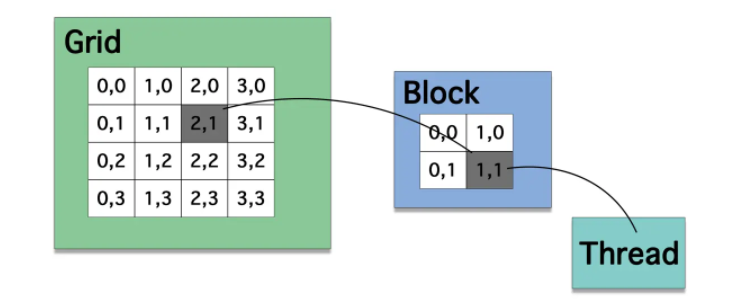

# GPU架构
## 思考
从硬件角度分析Compute Shader的线程为什么需要那样
>[TODO：设置到Compute Shader的笔记](./2020-4-21-test.md)

#
## ALU结构
Compute Unified Device Architecture(统一计算架构)  
线程为最小单位,结构为Grid(二位数组) -> Block(二位数组) -> Thread 
 

