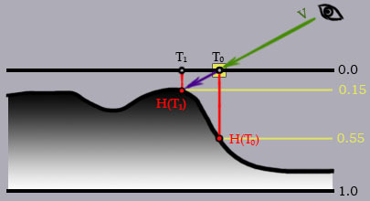
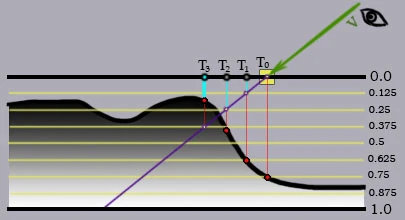
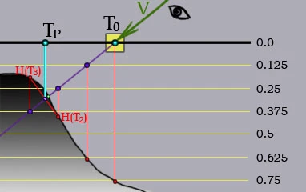
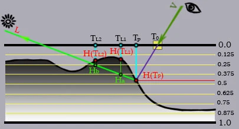

<!--
 * @Author: Tcyily
 * @Date: 2022-03-01 00:45:41
 * @LastEditTime: 2022-03-09 11:37:27
 * @LastEditors: Tcyily
 * @Description: 对于RoomScene1项目的地毯效果的学习笔记
 * @FilePath: \tcyily.github.io\_posts\2022-2-28-RoomScene1-Fabric.md
-->
# 樱花兔-项目RoomScene学习-地毯效果

## 1. 项目技术栈
    采用了HRDP + ShaderGraph来实现

--- 

## 2. 个人复刻
    1. 采用URP
    2. 同样采用ShaderGraph
    3. 如何提高原项目的帧率（60FPS in 3070）

--- 

## 3. 实现思路
    采用

---

## 4. 关键点  

### 4.1. ShaderGraph节点 - Parallax Occlusion Mapping  
    问题1：该节点有什么作用 
        译为视差遮蔽映射；在项目之中将视角移至与地毯平齐，发现并没有顶点生成绒毛。推测功能为类似法线贴图，在不改变模型的情况下通过光线的作用来模拟物体表面的起伏  

    问题2.内部是如何实现的
        需要：高度图x1，法线贴图x1，漫反射颜色映射贴图x1
        步骤：
            0. 在切线空间之中
            1. 0.0水平面为Plane的初始高度
            2. 对T0的地方进行高度图的采样，发现深度为0.55;
            3. 那么视线V还可以进行往前走，直到T1点
            4. 使用T1点的位置作为UV，对颜色贴图，法线贴图采样
  

是不是很像体渲染？原有的Plane相当于一个成像平面。在于该平面接触之后，判断是否于体素有相交，没有则进行往前步进。
   

> 具体处理如下（颗粒度太小的step marching式的开销过大，故有各种特性方案
### 4.1.1 特性来源-T1点如何求(陡峭视差映射：
     1. 划分多个成像平面
     2. 当前viewDir在当前成像平面的层深 在 深度图取得的H之上（即小于H），则与下一层的再次进行此检测
     3. 下图所示，最后交于0.375这个面。可得出xy所需进行的偏移
  
 

### 4.1.2 特性来源-T1点如何求(视差遮蔽映射：
>基于陡峭视差映射的优化版本  

    0. 对陡峭视差映射的结果进行了插值处理
    1. 深度图采样H(T3) - 终点T3层深0.375 得 Dis(t3) // <= 0
    2. 深度图采样H(T2) - 终点前一点T2层深 0.25 得 Dis(t2) // > 0
    3. weight = Dis(t3) / (dis(t3) - dis(t2))
    4. 最后插值出交点 tp =  t2 * weight + t3 * (1- weight)

  
 

### 4.1.3 拓展 POM 自阴影

    1. 在采样点 与 灯源 之间的层级进行判断，当此层位于深度图表示的深度里，则计算权重
    2. Tp 点向 L 方向进行步进，在Tp点之上共有层数n = 4
    3. T(l1)点位于深度图之中，权重为 (1 - 1/n * index), n为层数， index 为层数(由1开始)，故权重为 3/4
    4. T(l2)点位于深度图之中，权重为1/2
    5. 接下来的两层都在深度之外，无贡献
    6. 从weight选出最大的值，作为阴影的系数
    7. 根据这个系数，由自定义算法渲染出阴影

  

> [资料1： [译] GLSL 中的视差遮蔽映射（Parallax Occlusion Mapping in GLSL](https://segmentfault.com/a/1190000003920502)

