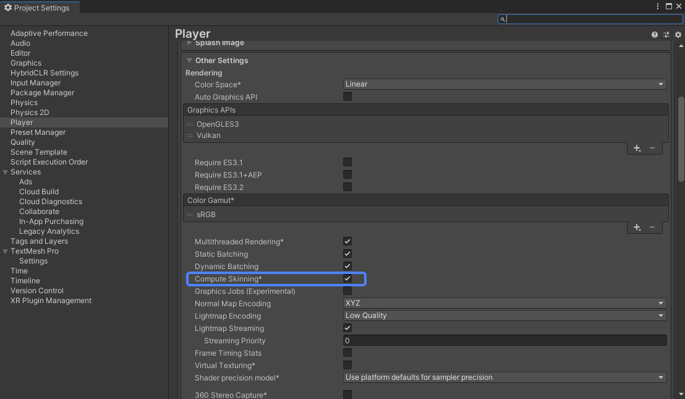

# 场景优化
1. 避免将四散的小物品合批成一个。
2. 重要性低的场景模型减面。
3. 实时光开销大，采用烘焙替换。
4. 烘焙后，无需深度信息可屏蔽ShadowCaster Pass 。
5. 通过笔刷定点生成草体，减少数量以及tex2DLod调用。
6. 草体交互采用传入当前位置，作为Camera记录路径的Trick
7. 后处理Shader需要时才开启。

# 角色优化
1. 实时投影采用 PlanerShadow 替换
2. 同屏NPC较多，NPC只采用基本着色Pass
3. 部件材质球合并

# 技巧
1. 热更版本文件标注改动内容，切版本不方便可标注好FPS
  
1. 需要在真机上进行性能瓶颈定位，pc端性能会遮蔽一些问题。
2. 初步定位可以使用UnityProfile连接真机
3. 调试时，尽量控制同屏元素以减少干扰。

# 实例
1. 新手村场景分析
  情况：在最低配置测试机上运行，场景15FPS左右浮动。
  1. 屏蔽NPC、屏蔽草体；只渲染场景帧率依旧只有30FPS。
  2. UnityProfiler连接真机，发现瓶颈存在于GPU
  3. RenderDoc截帧真机画面，查看耗时发现两块地面模型耗时占比最高；屏蔽其他物品
  4. 尝试缩放地面，帧率与地面屏占比成反比。此时大致可定位是shader的原因。
  5. 查看材质球面板，发现开启了透明度裁剪，而shader中对应的代码为Clip()，是常见的高开销函数。关闭。
  6. 顺带发现多个场景模型开启了没必要的双面渲染（Cull Off），关闭。
  
2. 战斗场景分析
  情况：战斗场景理论上和新手村一致，运行时发现帧率低于预期。
  1. Unity运行，发现DC异常
  2. FrameDebugger直接在Unity截帧，发现有流程中有两个Camera在渲染，屏蔽冗余的。帧率依旧未达到预期
  3. UnityProfiler连接真机，发现瓶颈依旧是GPU
  4. 屏蔽已经优化过的场景元素，仅保留战斗中的两只斗鸡。帧率依旧异常。
  5. 查看节点树，存在多个激活的无用Camera。沟通后在合适的代码里屏蔽
  6. 查看渲染中的相机，发现挂载了后处理脚本，且长期处于active
  7. 屏蔽后，查看帧率正常。

3. 视野外的NPC占用着GPU资源
  情况：在看不见NPC的地方，运行帧率没有单开场景的时候高。
  1. FrameDebugger 查看，发现NPC鸡也并没有进入渲染。
  2. 先解决这个问题，采用GeometryUtility.TestPlanesAABB进行自定义视锥体裁剪，屏蔽视野外的斗鸡。可修改Camera.farClipPlane 来自定义视距。
  3. 继续查看问题根因。开启/关闭裁剪后，对比FrameDebugger流程，发现多了Compute Skinning。沟通发现逻辑开启了SkinnedMeshRenderer.updateWhenOffscreen。
  4. 印象中相关计算应该是在CPU处理，为什么会转移到GPU？查阅后发现应该是开启了这个
  

资料分享：
[Unity 官方优化指南]
https://learn.u3d.cn/tutorial/mobile-game-optimization?chapterId=63562b28edca72001f21d125#61164663feec0d00200df1da
https://learn.u3d.cn/tutorial/unity-optimization-metaverse?chapterId=63562b26edca72001f21d020#62caf111c856c1002066c7bf

[PlanerShadow]
https://zhuanlan.zhihu.com/p/31504088
[Camera相关]
https://blog.unity.com/cn/games/part-2-optimize-game-performance-with-camera-usage
